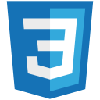

## Anthony Chavis

I am a passionate software engineer and former electrician with a background in biochemistry and psychology.

<h2>Toys of the Trade</h2>

 
 

<h2>Social Media</h2>

[][twitter]

<!-- replace w/ X icon !! -->

 
 

<h2>Educational Resources</h2>

- [Codecademy][codecademy]
- [Microsoft][microsoft]
- [Codewars][codewars]
- [Exercism][exercism]
- [LeetCode][leetcode]

<!-- - 🔬 Currently working on python challenges -->
<!-- - 🌱 Learning Angular v17 -->
<!-- - 🔭 Very interested in Web Accessibility, XR, & Three.js -->
<!-- - 🛠️ Improving my skills with  -->
<!-- - ⚡ Fun fact #1: My favorite author writes fairy tales -->
<!-- - ⚡ Fun fact #2: There is one video game I enjoy playing == retired q3 2023 -->

<!-- [currentProject]: -->

[codecademy]: https://www.codecademy.com/profiles/AnthonyCh.
[codewars]: https://www.codewars.com/users/gitanthony
[exercism]: https://exercism.org/profiles/anthonychavis
[leetcode]: https://leetcode.com/anthonychavis/
[microsoft]: https://learn.microsoft.com/en-us/users/anthony-1663/
[twitter]: https://twitter.com/gitanthony1

<!-- [linkedin]: https://www.linkedin.com/in/anthony-chavis/ -->

<!-- Resources:
Icons:
- https://devicon.dev/
- https://techstack-generator.vercel.app -->

<!--

**anthonychavis/anthonychavis** is a ✨ _special_ ✨ repository because its `README.md` (this file) appears on your GitHub profile.

Here are some ideas to get you started:

- 🔭 I’m currently working on ...
- 🌱 I’m currently learning ...
- 👯 I’m looking to collaborate on ...
- 🤔 I’m looking for help with ...
- 💬 Ask me about ...
- 📫 How to reach me: ...
- 😄 Pronouns: ...
- ⚡ Fun fact: ...
-->
