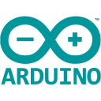
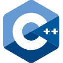

# Anthony Chavis

I am a passionate software engineer and former electrician with a background in biochemistry and psychology.

## Current Project(s):

<h3>Rabbit</h3>

                
- [Rabbit GitHub repo](https://github.com/anthonychavis/my-arduino-repo/tree/main/Theatre/Rabbit "URL to the Rabbit GitHub repo")
- **Tech**
    - Arduino
    - C++
    - Servo
        - _9g_
        - _180 deg_
    - Circuit Playground Express
        - _& other boards_

 

## Recent Project(s):

<h3>Event Schedule</h3>

- [Event Schedule website](https://artscapeschedule.netlify.app/ "external URL to the Event Schedule website") (_URL to external web page_)
- **Tech**
    - HUGO
        - _with my own HUGO "theme"_
    - Markdown
    - HTML
    - CSS

 
 

<h2>Some Tech I've Used</h2>

<!--  -->

<!--  -->

<!--  -->

<!--  -->
<!--  -->
<!--  -->

 
 

<h2>Social Media</h2>

_NOTE: the following URLs are to external websites_

[][twitter]

 
 

<h2>Educational Resources</h2>

_NOTE: the following URLs are to external websites_

- [Codecademy][codecademy]
- [Microsoft][microsoft]
- [Codewars][codewars]
- [Exercism][exercism]
- [LeetCode][leetcode]

[codecademy]: https://www.codecademy.com/profiles/AnthonyCh. "external URL to Anthony's Codecademy profile"
[codewars]: https://www.codewars.com/users/gitanthony "external URL to Anthony's Codewars profile"
[exercism]: https://exercism.org/profiles/anthonychavis "external URL to Anthony's Exercism profile"
[leetcode]: https://leetcode.com/anthonychavis/ "external URL to Anthony's LeetCode profile"
[microsoft]: https://learn.microsoft.com/en-us/users/anthony-1663/ "external URL to Anthony's Microsoft Learn profile"

[twitter]: https://twitter.com/gitanthony1

<!-- [linkedin]: https://www.linkedin.com/in/anthony-chavis/ -->

<!-- Resources:
Icons:
- https://devicon.dev/
- https://techstack-generator.vercel.app -->
